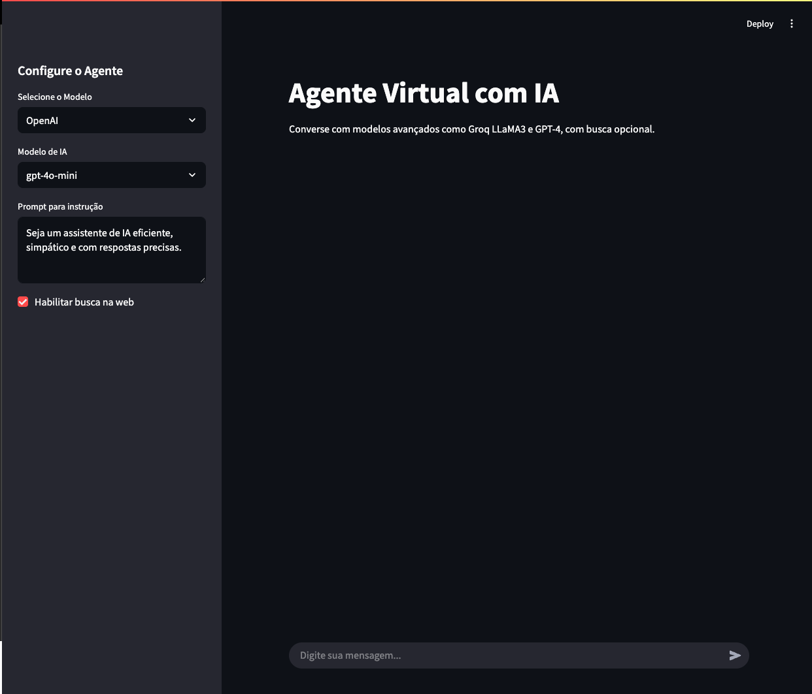

# 🧠 Agente Virtual com IA (LangChain + LangGraph + GPT-4o/LLaMA3)

Este projeto apresenta a implementação de um agente virtual full-stack, pronto para produção, utilizando as tecnologias mais avançadas do ecossistema de inteligência artificial. Por meio da integração de ferramentas modernas para orquestração de agentes, modelos de linguagem de última geração e APIs de busca em tempo real, esta solução demonstra robustez, escalabilidade e eficiência para aplicações inteligentes.

Este projeto demonstra como construir um chatbot inteligente com:

* **LangChain** e **LangGraph** para orquestração de agentes
* **Groq (LLaMA-3)** ou **OpenAI GPT-4o** como modelo de linguagem (LLM)
* **Tavily Search API** para buscas em tempo real na web
* **FastAPI** como backend
* **Streamlit** como frontend web interativo





## 🚀 Funcionalidades

* 🧠 Raciocínio multiagente com LangGraph e LangChain
* 🗂 LLM com contexto, usando GPT-4o ou LLaMA-3 (via Groq)
* 🌐 Busca em tempo real com Tavily
* 🖥️ Interface de chat responsiva com Streamlit
* ⚡ Backend assíncrono e rápido com FastAPI
* 🛠️ Estrutura full-stack escalável e pronta para produção

---

## 🛠️ Tecnologias Utilizadas

| Camada       | Tecnologia                    |
| ------------ | ----------------------------- |
| LLM          | OpenAI GPT-4o ou Groq LLaMA-3 |
| Orquestração | LangChain, LangGraph          |
| Busca Web    | Tavily API                    |
| Backend      | FastAPI                       |
| Frontend     | Streamlit                     |

---

## 📦 Instalação

### 1. Clone o Repositório

```bash
git clone https://github.com/alevtelles/Agente-virtual-com-IA
cd Agente-virtual-com-IA
```

### 2. Instale as Dependências

Recomenda-se o uso de um ambiente virtual:

```bash
python -m venv venv
source venv/bin/activate  # ou venv\Scripts\activate no Windows

pip install -r requirements.txt
```

### 3. Configure as Variáveis de Ambiente

Crie um arquivo `.env` na raiz do projeto com:

```env
OPENAI_API_KEY=sua_chave_openai
GROQ_API_KEY=sua_chave_groq
TAVILY_API_KEY=sua_chave_tavily
```

---

## ▶️ Executando a Aplicação

### Inicie o Backend com FastAPI

```bash
uvicorn app.api:app --reload
```

### Inicie o Frontend com Streamlit

```bash
streamlit run frontend/app.py
```

---

## 📚 O Que Você Vai Aprender

✅ Como configurar uma arquitetura multiagente com **LangGraph**
✅ Como usar e alternar entre **GPT-4o** e **LLaMA3**
✅ Como integrar buscas em tempo real com **Tavily**
✅ Como criar uma API escalável com **FastAPI**
✅ Como construir uma interface de chat moderna com **Streamlit**

---

## 💡 Casos de Uso

* Assistentes de atendimento ao cliente
* Bots de pesquisa com IA
* Análise de mercado com busca em tempo real
* Resumos de notícias ao vivo
* Copilotos pessoais com IA

---

## 📁 Estrutura do Projeto

```
chatbot-agentic-ia/
├── app/
│   ├── agents/              # Configuração dos agentes (LangChain + LangGraph)
│   ├── api.py               # Backend FastAPI
│   ├── chains/              # Cadeias e ferramentas LangChain
│   └── utils.py             # Utilitários e configurações
├── frontend/
│   └── app.py               # Frontend com Streamlit
├── .env                     # Variáveis de ambiente (chaves)
├── requirements.txt
└── README.md
```

---

## 🤝 Contribuição

Contribuições são bem-vindas! Sinta-se à vontade para fazer um fork e enviar um pull request com melhorias, correções ou novas ideias.


